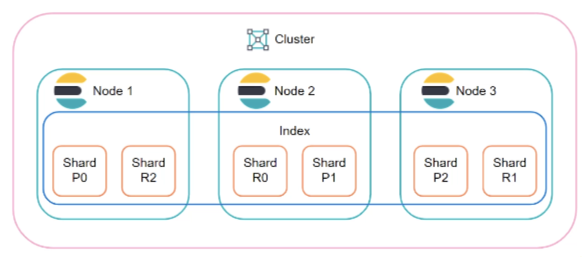

# 1장 SQL 처리 과정과 I/O

## 1. SQL 최적화

DBMS 내에서 DBMS 내에서 SQL을 분석하고, 실행 가능한 최적의 형태로 변환하는 전 과정을 의미한다.

주요 단계는 다음과 같다

* **SQL 파싱**: SQL 문을 구성 요소로 분해하고, 문법적·의미적 오류 검사
* **SQL 최적화**: 옵티마이저가 여러 실행 계획 중 가장 효율적인 방법 선택
* **로우 소스 생성**: 선택된 실행 계획을 실제 실행 가능한 코드 또는 프로시저 형태로 변환

이 중 SQL 최적화는 데이터베이스 성능을 결정하는 핵심 절차이다.

### SQL 옵티마이저

사용자가 원하는 작업을 가장 효율적으로 수행할 수 있는 최적의 데이터 엑세스 경로를 선택해주는 DBMS 핵심 엔진이다.

**SQL 최적화 단계**

* 쿼리를 수행하는 데 후보 실행 계획을 찾아낸다.
* 데이터 딕셔너리에 미리 수집해둔 오브젝트 통계 및 시스템 통계 정보를 통해 각 실행 계획의 예상 비용을 산정한다.
* 최저 비용의 실행 계획을 선택한다.

### 실행 계획

**AUTOTRACE**

Oracle은 AUTOTRACE를 통해 확인할 수 있다.

Cost는 쿼리를 수행하는 동안 발생할 것으로 예상하는 I/O 횟수 또는 예상 소요 시간을 표현한다. 이 값은 어디까지나 예상치이므로 실제로 발생하는 I/O, 시간과 많은 차이가 날 수 있다.

```sql
SQL> SET AUTOTRACE TRACEONLY EXPLAIN;
SQL> SELECT * 
FROM t 
WHERE deptno = 10 AND no = 1;

---------------------------------------------------------------------------------
| Id | Operation                   | Name  | Rows | Bytes | Cost (%CPU)| Time  |
---------------------------------------------------------------------------------
|  0 | SELECT STATEMENT            |       |    5 |   125 |     2   (0)| 00:00:01 |
|  1 | TABLE ACCESS BY INDEX ROWID | T     |    5 |   125 |     2   (0)| 00:00:01 |
|* 2 | INDEX RANGE SCAN            | T_X01 |    5 |       |     1   (0)| 00:00:01 |
---------------------------------------------------------------------------------
```

**옵티마이저 힌트**

옵티마이저가 보편적으로 좋은 쿼리를 선택하지만, 항상 최선은 아닐 수 있다.

이럴 때 옵티마이저 힌트를 이용해 특정 인덱스를 선택하도록 데이터 액세스 경로를 바꿀 수 있다.

```sql
SELECT **/*+ index(t t_x02) */** 
고객명, 연락처
FROM 고객 A
WHERE 고객ID = 10;
```

MySQL은 Explain, Explain analyze 을 사용할 수 있다.

## 2. SQL 공유 및 재사용

### 라이브러리 캐시

사용자가 SQL 문을 입력하면 SQL, 최적화, 로우 소스 생성 과정을 거쳐 실행 계획과 관련된 결과를 메모리에 저장한다. 옵티마이저의 최적화 과정에서 많은 연산을 필요로 하기 때문이다.

<figure><figcaption></figcaption></figure>

