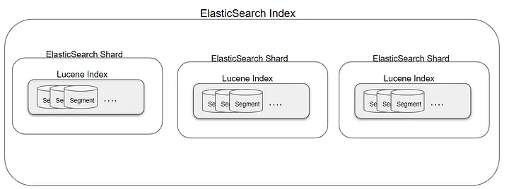

# 9장 엘라스틱서치 구성요소

엘라스틱서치의 최상위 개념인 클러스터부터 최하위 개념은 세그먼트까지 하향식으로 개념을 파악해보자.

### 클러스터

데이터를 실제로 가지고 있는 **노드의 모음**으로, 관련된 모든 노드를 논리적으로 확장해서 클러스터라고 부른다. \
같은 클러스터 내부의 데이터만 서로 공유가 가능하기 때문에 모든 노드가 하나의 클러스터에서 구성원으로 연결되는 것이 중요하다. 같은 클러스터 내부의 노드는 평소 데이터 색인이나 검색 작업을 함께 수행하고, 장애가 발생했을 때 데이터 복구를 위해 다양한 작업을 함께 진행한다.

<figure><figcaption></figcaption></figure>

다수의 클러스터를 운영하거나 데이터가 커져서 클러스터를 분리해야 하는 일도 종종 있는데, 다수의 클러스터를 한 번에 검색할 수 있도록 Cross Cluster Search 기능을 제공한다. 다수의 클러스터 데이터를 한번에 검색할 수 있게 한다.

과거에는 트라이브 노드(tribe node) 기능으로 제공됐지만, 최신에는 Cross Cluster Search 기능으로 개선하여 대체되었다.

### 노드

엘라스틱서치 클러스터를 운영하기 위해 설치하여 실행하는 **인스턴스**를 의미한다.

노드 실행 시, 노드는 클러스터에 의해 데이터를 식별할 수 있는 uuid가 할당된다. 직접 원하는 이름을 설정할 수도 있다.

* 노드는 다수의 인덱스를 가지고 있으며, 각 인덱스는 다수의 문서를 가짐
* 같은 클러스터 내의 모든 노드는 수시로 서로 정보를 주고받음
* 기본적으로 마스터 노드와 데이터 노드의 역할을 동시에 수행할 수 있도록 설정되어 있지만, 실제 운영 시에는 **역할에 따라 노드를 물리적으로 분리하는 것을 권장함**

**노드 종류**

* master 노드
* data 노드
* Ingest 노드
* tribe 노드
* coordinating 노드

### 인덱스

유사한 특성을 가지고 있는 문서들을 모아둔 컬렉션이다. RDB로 치면 테이블같은 개념이라고 볼 수 있다.

* 클러스터 내에서 유일한 인덱스명을 가져야 함
* 인덱스명은 모두 소문자로 설정해야 함
* 과거에는 인덱스 내부에 여러 개의 타입을 생성하는 것이 가능했지만, 현재는 하나의 타입만 생성해야 함. 타입은 인덱스 내부에서 데이터를 논리적으로 분리하도록 하는 개념

### 샤드

**인덱스는 기본적으로 샤드라는 단위로 분리**되고, 각 노드에 분산되어 저장된다.

인덱스의 전체 데이터를 분산해서 가지고 있는 부분집합을 의미한다. 데이터를 분산 저장하기 위한 방식으로 **수평 확장을 쉽게 한다.**

* 기본적으로 1개의 샤드로 설정되며 조절할 수 있음 (7.0 버전 이전에는 기본5개)
* 인덱스에 쿼리를 요청하면 인덱스가 가지고 있는 모든 샤드로 검색 요청이 전달되고, 각 샤드에서 검색하여 취합함
* 인덱스 생성 이후에 **샤드 개수를 변경이 불가능**함

**샤딩이 중요한 이유**

* 지속적으로 증가하는 데이터가 수평적으로 분할되어 하드웨어의 한계 극복 가능
* 분산 처리되므로 **성능이나 처리량 향상**할 수 있음

#### 무중단으로 샤드 추가가 가능할까?

#### 샤드 개수 Tip

샤드 개수는 초기에 설정하여 변경할 수 없다. 서비스를 운영하다 보면 데이터가 많아지고 성능상 문제가 발생할 가능성이 커지므로, 충분한 고민으로 샤드 수를 결정해야 한다.

### 레플리카

샤드의 복제본을 의미한다. 기본적으로 1개의 레플리카 세트를 생성한다.

레플리카는..

* **검색 시 적극적으로 활용**되므로 이를 이용하면 **읽기 분산**에 유용함
* 장애 발생 시 **페일오버(Failober) 메커니즘**에 활용되어 안정적인 클러스터 운영을 보장함. 이를 위해 원본 샤드가 존재하지 않는 노드에서 생성
* 레플리카 개수 자유롭게 변경 가능

### 세그먼트

루씬에 데이터가 색인되어 토큰화되어 **저장되는 자료구조**를 의미한다. 읽기에 최적화된 자료구조로, 역색인으로 변환되어 물리적인 디스크에 저장된다.

### 루씬 인덱스

루씬 인덱스는 **색인과 검색을 동시에 제공하는 루씬 인스턴스**를 의미한다. 세그먼트를 이용해 검색을 수행하며, 이는 내부적으로 역색인 구조를 가지므로 빠른 검색 결과를 얻을 수 있다.

**하나의 샤드는 하나의 루씬 인덱스**라고 설명할 수 있으며, 루씬 인덱스가 핵심 본질이기도 하다.

루씬 인덱스의 경우 데이터를 저장할 때 물리 머신이 제공하는 리소스의 한계를 뛰어넘을 수 없다는 치명적인 문제가 있었지만, 샤드를 통해 데이터를 무한으로 확장할 수 있게 되었다.

<figure><figcaption></figcaption></figure>

## 참고

* [http://esbook.kimjmin.net/03-cluster/3.1-cluster-settings](http://esbook.kimjmin.net/03-cluster/3.1-cluster-settings)
* [https://github.com/KimDoubleB/LAB/issues/2#issuecomment-1768641192](https://github.com/KimDoubleB/LAB/issues/2#issuecomment-1768641192)
