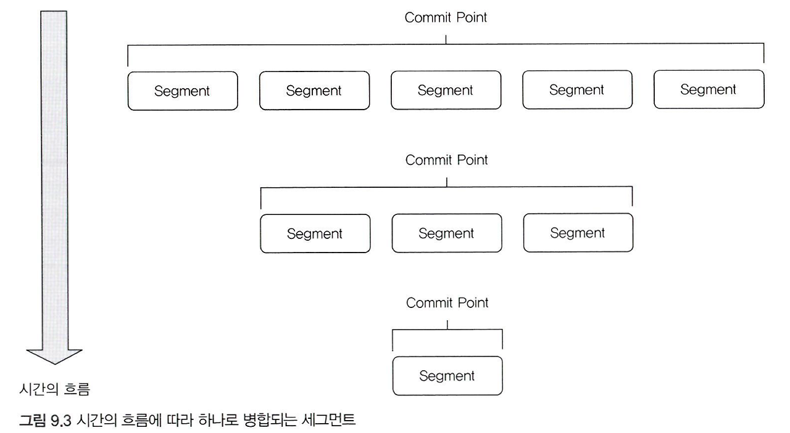

# 엘라스틱서치가 근실시간 검색을 제공하는 이유

엘라스틱서치는 처음부터 **다양한 데이터의 색인**과 **근실시간 검색을 제공**하는 것을 목표로 개발됐다.

색인(indexing)과 검색이 매우 빠르게 일어나는데, 색인 결과가 물리적인 디스크에 생성됨에도 **근실시간 검색이 제공될 수 있는 이유**는 무엇일까?

## 색인 작업 시 세그먼트 기본 동작

### 세그먼트 단위 검색

각 세그먼트의 검색 결과를 합쳐 응답한다. 세그먼트는 역색인 구조를 지닌 파일을 통해 빠른 조회를 가능하게 한다.

### 커밋 포인트

커밋 포인트는 여러 세그먼트의 목록 정보를 가지며, IndexSearcher는 가장 오래된 세그먼트부터 차례대로 검색하여 결과를 집계한다.

**색인 작업 요청이 들어오면,**

* IndexWriter에 의해 색인 작업이 이루어짐
* 색인 완료 및 세그먼트 생성
* 그 후 추가 요청 시마다 새로운 세그먼트 생성 및 커밋포인트 기록

**검색 요청이 들어오면,**

* IndexSearcher가 커밋 포인트를 이용해 모든 세그먼트를 읽음
* 검색 결과 제공

### 세그먼트 병합

세그먼트의 개수는 빠르게 늘어나므로, 백그라운드에서 주기적으로 세그먼트 파일을 Merge(병합)하는 작업을 수행하여 물리적으로 하나의 파일로 병합한다.

<figure><figcaption></figcaption></figure>

## 세그먼트 불변성

루씬에서 수정을 허용하지 않는 세그먼트의 이러한 동작 방식을 불변성이라 한다. 대용량 텍스트를 다루는 역색인 구조에서는 불변성이 제공하는 여러 **장점**이 있다.

* 동시성 문제를 회피할 수 있다
* 시스템 캐시를 적극적으로 활용할 수 있다
* 높은 캐시 적중률을 유지할 수 있다
* 리소스를 절감할 수 있다

불변성에도 몇 가지 단점이 있다.

* 수정 불가능
* 실시간 반영이 상대적으로 어려움

읽기 연산의 비중이 큰 루씬에서는 세그먼트에 불변성을 부여하여 읽기 연산의 성능을 대폭 끌어올릴 수 불변있다.

## 불변성인데 수정과 삭제는 어떻게 하는걸까?

**수정 연산**

**삭제 후 다시 추가**하는 방식으로 동작한다.

**삭제 연산**

바로 데이터를 삭제하는 것이 아니라, **데이터의 삭제 여부를 표시**하는 비트배열을 찾아 삭제 여부를 표시한다. 검색 시 삭제 여부를 항상 먼저 판단한다. 백그라운드에서 세그먼트 병합 작업이 실행될 때, 실제 물리적으로 삭제된다.

## 루씬의 Flush, Commit, Merge

### In-memory buffer

루씬은 효율적인 색인 작업을 위해 일정 크기의 **인메모리 버퍼(In-memory buffer)**&#xB97C; 가진다. 색인 작업이 요청되면, **데이터를 버퍼에 쌓고 일정 주기마다 한꺼번에 처리**한다. 일종의 큐로 활용하는 것이다.

### **색인 과정**

* **Flush**: 세그먼트가 생성된 후 **검색이 가능**해지도록 수행하는 작업
* **Commit**: 커널 시스템 캐시의 내용을 **물리적인 디스크로 쓰는 작업**, 많은 리소스 필요
* **Merge**: 다수의 세그먼트를 하나로 통합하는 작업, 물리적인 삭제 처리가 수행 및 세그먼트 개수가 줄어 검색 성능이 좋아지는 단계

## 엘라스틱서치의 Refresh, Flush, Optimize

루씬의 대표적인 튜닝 포인트인 flush, commit, merge 과정은 엘라스틱서치에서 refresh, flush, optimize로 부른다. 엘라스틱서치는 루씬보다 **고가용성이 보장되어야 하는 분산 검색엔진**이므로 이에 맞게 개선 및 확장해서 제공한다.

| Flush  | Refresh      |
| ------ | ------------ |
| Commit | Flush        |
| Merge  | Optimize API |

### Refresh

인덱스를 새로고침한다는 의미로, 새로 추가한 데이터의 검색이 가능해지게 한다는 의미로, 실제 행위에 가까운 의미를 부여한다.

* Refresh 주기는 기본적으로 1초다
  * 주기를 수동으로 조절할 수 있으나 변경하는 것은 별로 권장하지 않는다.
* **대량의 데이터를 색인하는 경우** 색인 성능이 크게 저하될 수 있으므로 **잠시 비활성화**하는 것이 좋다.

```sql
PUT /movie/_settings
{
	"index": {
		"refresh_interval": "-1" // 비활성화, 기본값 "1s"
	}
}
```

### Flush

루씬의 commit 작업을 수행하고 새로운 Translog를 시작한다.

* 기본적으로 5초의 주기를 가진다
  * 조절할 수 있으나, refresh와 마찬가지로 수정을 권장하지 않는다

**Translog**

엘라스틱서치에서 **장애 복구를 위해 제공되는 특수한 파일**이다. 샤드는 모든 변경사항을 Translog에 먼저 기록하고 내부에 존재하는 루씬을 호출한다. 루씬 commit 이 정상적으로 수행되면 디스크에 물리적으로 기록되고, Translog 파일에서 commit 시점까지의 내역이 삭제된다.

### Optimize

인덱스 최적화를 위해 루씬 Merge 작업을 강제로 수행하는 기능이다. 다수의 세그먼트를 하나의 큰 세그먼트로 통합해서 빠른 검색 성능을 제공하게 한다.

```sql
POST /movie/_forcemerge?max_num_segments=1
```

### 세그먼트 수가 줄면 검색 속도는 왜 향상될까?

전체 데이터 수는 동일할텐데, 세그먼트 수를 줄인다고 향상되는 이유가 궁금해졌다.

* 연산량 감소: 세그먼트 수에 비례해서 파일 I/O 감소함(인덱스 파일 오픈 및 term dictionary 접근)
* 검색 병합 비용 감소: 정렬, 우선순위 계산이 단순해짐
* 삭제 문서 처리: 이미 삭제된 문서가 실제로 삭제 처리됨

## **엘라스틱서치와 NRT(Near Real-Time)**

엘라스틱서치는 루씬에서 제공하는 Flush, Commit, Merge 작업을 확장해서 **분산 처리에 적합**하도록 제공한다.

샤드는 장애 복구 기능을 가진 루씬 기반의 단일 검색 서버로써 역할을 수행하고, 루씬이 가지는 불변성을 그대로 활용하여 **세그먼트 단위 검색**을 하면 **색인과 거의 동시에 검색이 가능**하다.

## 참고

* [http://esbook.kimjmin.net/03-cluster/3.1-cluster-settings](http://esbook.kimjmin.net/03-cluster/3.1-cluster-settings)
* [https://www.elastic.co/kr/blog/how-many-shards-should-i-have-in-my-elasticsearch-cluster](https://www.elastic.co/kr/blog/how-many-shards-should-i-have-in-my-elasticsearch-cluster)
* [https://nothing-study.tistory.com/30](https://nothing-study.tistory.com/30)
